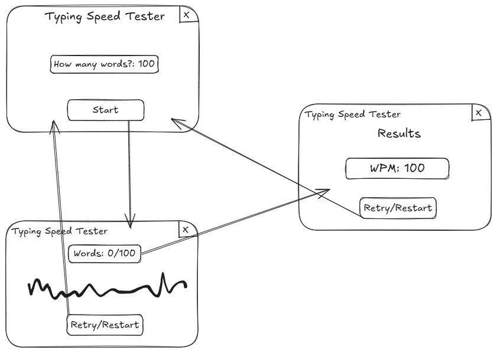
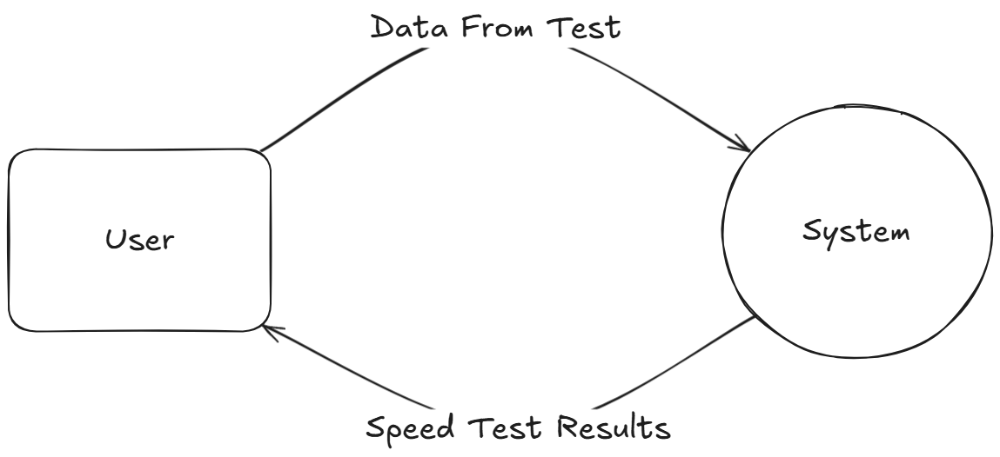
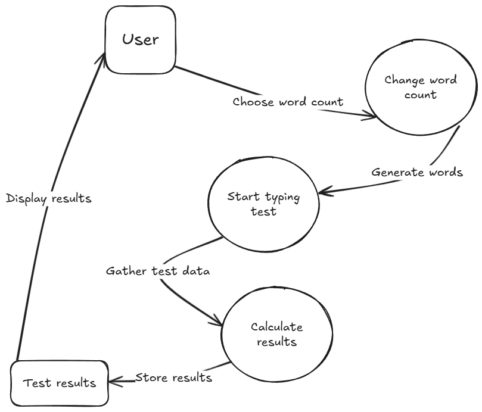

# **11SE Task 2 2025 - Typing Speed Tester**
### By Shawn

# **Sprint 1**
## **Requirements Definition**
### **Functional Requirements**
- **Data Retrieval:** The user needs to be able to view the randomised words for the typing test and their input as they type them which will end after the chosen amount of words are typed. The system should take the data of how much time the user took to type those words in the typing test and then calculate the words per minute.

- **User Interface:** The user should be able to view and type out the randomised words and interact with the button to try it again. There will also be an option to change how many words the user wants in the speed test. There should also be an exit button either on the user interface or just on the window to exit the application.

- **Data Display:** The user needs to be able to view their words per minute result after finishing the typing test, the amount of words they chose, as well as the time taken to type it.

### **Non-Functional Requirements**
- **Performance:** The user needs to be able to instantly register the user's input from the keyboard to ensure better precision and accuracy when measuring the WPM/typing speed.

- **Reliability:** The system should be very reliable, as any errors or inaccuracy when retrieving data will result in an inaccurate result for displaying the WPM.

- **Usability and Accessibility:** The system needs to be easy to navigate with minimalistic UI and display elements. The instructions on how to use/access the system will be in the README.md file attached with this project.

## **Determining Specifications**
### **Functional Specifications**
- **User Requirements:**
The user needs to be able to input/type letters of the given words into the system to be able to complete the typing test. The user also needs to be able to exit the application either by clicking on the exit button for the window, or click on a designated/custom button. They should be able to restart the typing test whenever they need (during or after the test).

- **Inputs & Outputs:** The system should accept keyboard inputs that the user types to do the typing test, as well as mouse (clicking) inputs to close the window. The system should output the randomised words that are for the typing test, and colour/highlight each letter when an input is received. After the typing test is completed, the system should output the statistics of the test (words per minute, how many words typed, and how much time it took for them to type it) and have a restart button at all times to either reset the run or the words.

- **Core Features:** The program needs to receive the inputs from the user, check if they are right, if not then there is a output (highlight of wrong letter) where the user needs to and at the end, needs to calculate the speed that the user typed.

- **User Interaction:** The user will interact with the system through an advanced GUI that is easy to navigate, with many buttons and text outputs to make it easier to use. A READ.ME file is attached with the program and it provides steps on how to use the typing speed test.

- **Error Handling:** Possible errors faced could be related to the API (dictionary) that is used by the system to provide randomised words for the typing test. Other errors could be something to do with the numbers being too long (wpm) which can be resolved by getting the result to round up or down. The system could also face calculation errors when it is calculating the wpm or processing the data.

### **Non-Functional Specifications**
- **Performance:** The system should perform tasks almost instantly, like updating the "Words Typed: " amount in real-time. This fast system response is required to maintain user engagement. The program can be ensured to be efficient by simplifying and correctly formatting code.

- **Useability / Accessibility:** To make the application more accessible, there could be options to change the font size, the font, or the highlight/font colours to improve visibility. To make the User Interface easier to use, the buttons should be clear and labelled to improve visibility as well.

- **Reliability:** Issues could include the inaccurate calculation of the wpm, the wpm being too long in decimals, or illogical calculation (words typed divided by 0 minutes). There could also be an issue when receiving the inputs from the user. These problems should be resolved and tested to ensure the reliability of the system.

### **Use Case**

**Actors:**

User (person who wants to test their typing speed)

**Preconditions:**

The application needs to be open and running, with the randomised words for the test loaded.

**Main Flow:**
1. The user opens the application
2. They select the configurations for the test.
3. They start typing after the words are loading.
4. The system collects the data from the typing and calculates the analytics.
5. After the user finishes, the data gathered from the test is displayed.

**Postconditions:**

The user is given results on their test, and is met with two buttons which either restart or exit the test.

## **Design**
### **Storyboard**


### **Data Flow Diagram: Level 0**


### **Data Flow Diagram: Level 1**


### **Gantt Chart**


## **Build and Test**
```
import tkinter as tk
from tkinter import ttk
import ttkbootstrap as tb # theme for tkinter

root = tb.Window(themename="cyborg") # theme for tkinter
root.title("Typing Speed Test") # window title
root.geometry("1920x1080") # window size

# title within the window
title = tb.Label(
    root,
    text = "Typing Speed Test",
    font = ("System", 48, "bold"),
    bootstyle = "light"
)
title.pack(pady=10)

# subheading welcoming the user to the app
subheading = tb.Label(
    root,
    text = "Welcome to the Typing Speed Test!!!",
    font = ("System", 32),
    bootstyle = "light"
)
subheading.pack(pady=10)

# subheading asking how many words for the test
howmanywords = tb.Label(
    root,
    text = "How many words?",
    font = ("System", 24),
    bootstyle = "light"
)
howmanywords.pack(pady=5)

# choices for word count
wordcountchoices = ["10", "25", "50", "100"]

# dropdown box to select word count
wordcount = ttk.Combobox(root, values = wordcountchoices)
wordcount.set("Select an option")
wordcount.pack(pady=10)

'''
function for selecting word count and outputting the choice into the console
'''
def on_select():
    selected_option = wordcount.get()
    print(f"You selected: {selected_option}")

# submit button to submit chosen word count
submit = tb.Button(root, text="Submit", command=on_select)
submit.pack(pady=10)

root.mainloop()
```

## **Review**
### **End of Sprint Review Questions**
- **Evaluate how effectively your project meets the functional and non-functional requirements defined in your planning.** As of right now, my project is a GUI that contains a dropdown box which lets the user select how many words they want to test, and there is also a submit button for users to submit their choice. These features partly fulfill my functional and non-functional requirements.

- **Analyse the performance of your program against the key use-cases you identified.** The program works well and behaves as expected, but as the program just includes the simple GUI, the use cases are only partly fulfilled.

- **Assess the quality of your code in terms of readability, structure, and maintainability.** For my code, it is well organised and readable as it has code comments and docstrings, but right now it is pretty simple.

- **Explain the improvements that should be made in the next stage of development.** The next improvements for my code would be to develop further and add more features to both the code and GUI such as generating words, being able to do the test and recieve inputs, and calculating the wpm.

## **Launch**
### **README.md**
```
import tkinter as tk
from tkinter import ttk
import ttkbootstrap as tb # theme for tkinter
from timeit import default_timer as timer
import random

# word pool for the typing test
with open("words.txt") as f:
    WORDS = f.read().split()

# main window
root = tb.Window(themename="cyborg") # theme for tkinter
root.title("Typing Speed Test") # window title
root.attributes('-fullscreen', True) # fullscreen

# title within the window
title = tb.Label(root, text = "Typing Speed Test", font = ("Century", 24, "bold"), bootstyle = "light")
title.pack(pady=10)

# subheading welcoming the user to the app
subheading = tb.Label(root, text = "Welcome to the Typing Speed Test!!!",  font = ("Century", 14), bootstyle = "light")
subheading.pack(pady=10)

# subheading asking how many words for the test
howmanywords = tb.Label(root, text = "How many words?", font = ("Century", 10), bootstyle = "light")
howmanywords.pack(padx=5)

# entry box for word count
wordcount = ttk.Entry(root, font=("Century", 8))
wordcount.pack(padx=10)
wordcount.focus()

# display words
words_display = tb.Label(root, text="", font=("Century", 8, "bold"), bootstyle="light", wraplength=1200)
words_display.pack(pady=10)

# text entry (to type)
text_entry = tb.Entry(root, font=("Century", 8), bootstyle="light", width=50)
text_entry.pack(pady=5)
text_entry.config(state="disabled") # disabled until started

# timer label
time = tb.Label(root, text="Time: 0.0 sec", font=("Century", 10), bootstyle="light")
time.pack(pady=5)

# label to display wpm results
results = tb.Label(root, text="", font=("Century", 10), bootstyle="light")
results.pack(pady=5)

# start typing timer
start_time = None
running_timer = None

def generate_words():
    """generate and display a random set of words from word pool"""
    num_words = int(wordcount.get()) if wordcount.get().isdigit() else 0 # validate input
    if num_words:
        words_display.config(text=" ".join(random.choices(WORDS, k=num_words))) # random select words
        text_entry.config(state="normal")
        text_entry.delete(0, tk.END)
        text_entry.focus() # focuses on the entry box (you can start typing without clicking on the box)

def update_timer():
    """updates the timer label every 100ms"""
    global start_time, running_timer
    if start_time:
        elapsed_time = timer() - start_time  # calculate run time
        time.config(text=f"Time: {elapsed_time:.1f} sec")  # update display
        running_timer = root.after(100, update_timer)  # update every 100ms

def start_typing(event=None):
    """starts the timer when user begins typing"""
    global start_time, running_timer
    if start_time is None: # makes sure timer only starts once
        start_time = timer()
        update_timer()

def end_typing():
    """calculate and display words per minute (WPM) when user submits"""
    global start_time, running_timer
    if start_time:
        elapsed_time = timer() - start_time  # total typing duration
        wpm = round(len(text_entry.get().split()) / (elapsed_time / 60))  # calculate WPM
        results.config(text=f"Your speed: {wpm} WPM")  # display results
        root.after_cancel(running_timer)  # stop the timer

# buttons
generate = tb.Button(root, text="Generate Words", command=generate_words, bootstyle="success")
generate.pack(pady=5)

submit = tb.Button(root, text="Submit", command=end_typing, bootstyle="danger")
submit.pack(pady=5)

exit = tb.Button(root, text="Exit", command=root.quit, bootstyle="danger")
exit.pack(pady=100)

# typing automatically starts timer
text_entry.bind("<Key>", start_typing)

root.mainloop()

# add highscore (WPM)
```

## **Review**
### **End of Sprint Review Questions**
- **Evaluate how effectively your project meets the functional and non-functional requirements defined in your planning.** My program is mostly effective at meeting the functional and non-functional requirements from my planning. I have implemented the word generating, time ticking, wpm calculating, and some more buttons for these.

- **Analyse the performance of your program against the key use-cases you identified.** 

- **Assess the quality of your code in terms of readability, structure, and maintainability.** 

- **Explain the improvements that should be made in the next stage of development.** 

## **Launch**

# **Sprint 3**
## **Design**

## **Build and Test**

## **Review**

## **Launch**

# **Sprint 4**
## **Design**

## **Build and Test**

## **Review**

## **Launch**
